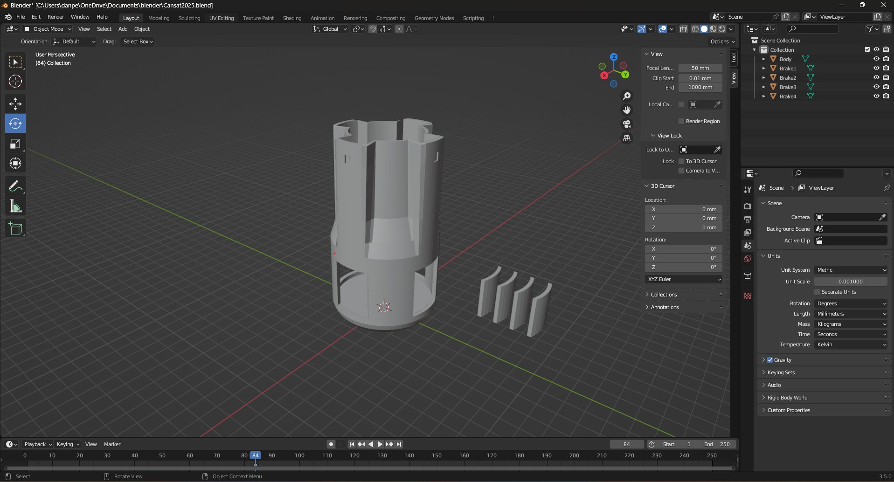
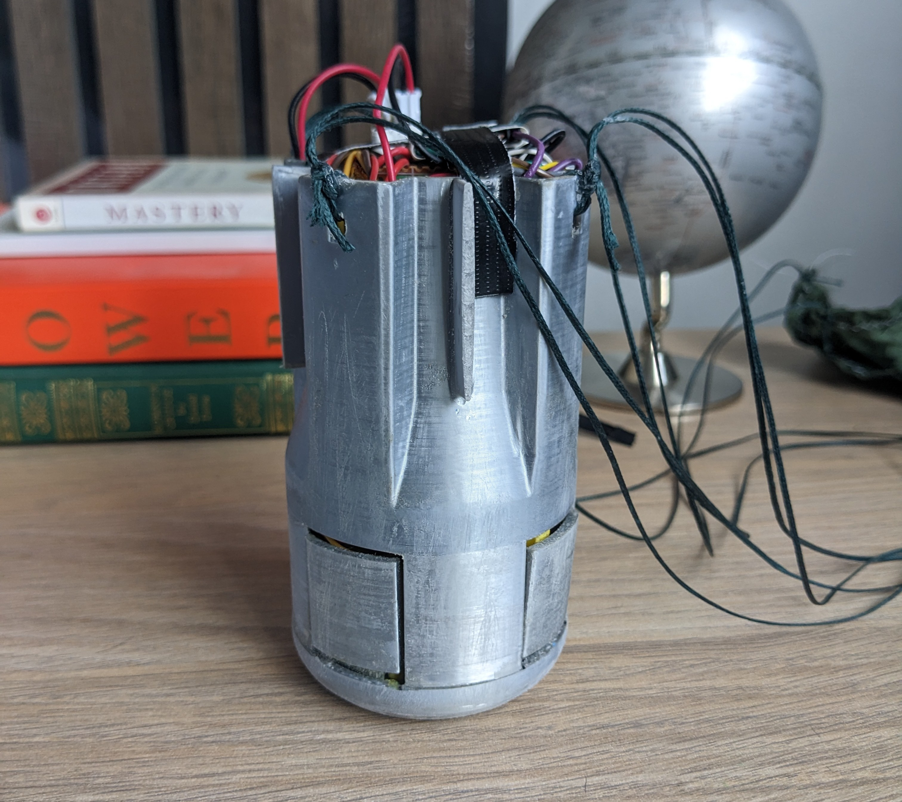
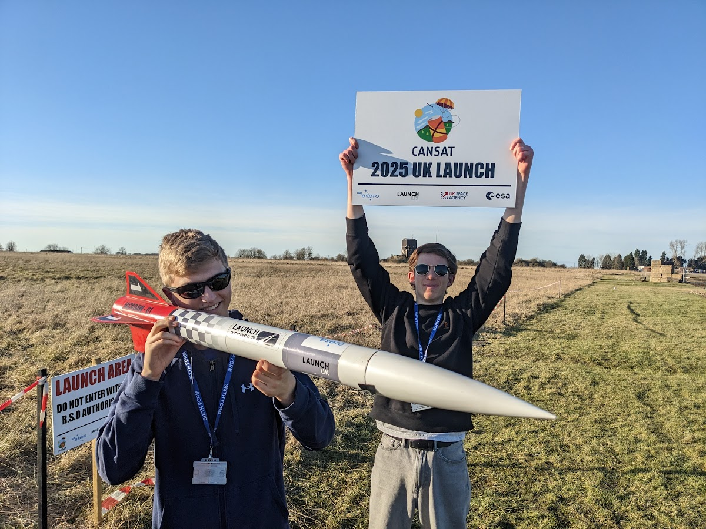

# Project Overview

This project comprehensively explores various aspects of building and managing a CanSat (a small satellite). Below is an explanation of the different parts of this project, their purposes, and the potential learning outcomes that I have gained from them:

## 1. Hardware Design
- **Purpose**: To design and assemble the physical components of the CanSat.
- **Learning Outcomes**: Understanding electronics, circuit design, and hardware integration. also learnt how to use 3d modelling software (Blender in this case) to design the body of the Cansat

## Photo of the 3D model

## 2. Software Development
- **Purpose**: To develop software to control the CanSat and process data.
- **Learning Outcomes**: Programming skills, software architecture, and real-time data processing.

## 3. Data Acquisition
- **Purpose**: To collect and store data from various sensors on the CanSat.
- **Learning Outcomes**: Sensor integration, data logging, and telemetry knowledge.

## Example of data collection using the software I made

## 4. Communication Systems
- **Purpose**: To establish reliable communication between the CanSat and the ground station.
- **Learning Outcomes**: Understanding of RF communication, signal processing, and networking.

## 5. Testing and Validation
- **Purpose**: To ensure that all systems work correctly under expected conditions.
- **Learning Outcomes**: Skills in testing methodologies, troubleshooting, and quality assurance.

## 6. Project Lifecycle Management
- **Learning Outcomes**: Experienced all phases of a real space project, from concept to launch. Learned to manage resources, timelines, and potential risks.

## 6. Project Management
- **Purpose**: To manage the project timeline, resources, and team collaboration.
- **Learning Outcomes**: Project management skills, teamwork, and effective communication.

## Photo of the final Cansat

## Photo from the day of the launch

## Conclusion
Working on this project, I have gained hands-on experience in multiple disciplines, including engineering, programming, and project management, which I believe are essential for a successful career in technology and science.
