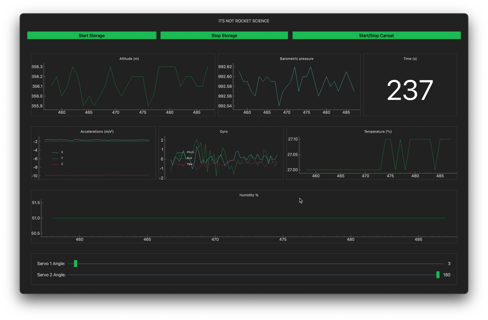

# CanSat Project: A Comprehensive Space Technology Journey

## Project Overview

This project represents a holistic exploration of small satellite (CanSat) technology, showcasing the intricate process of designing, developing, and launching a miniature satellite. CanSats are small, can-sized satellites typically used for educational and research purposes, providing an excellent platform for learning about space technology, engineering, and systems integration.

## Project Objectives
- Develop a fully functional miniature satellite
- Demonstrate practical applications of aerospace engineering
- Gain hands-on experience across multiple technical disciplines

## 1. Hardware Design
- **Purpose**: Design and assemble the physical components of the CanSat
- **Key Components**:
  - Structural chassis
  - Electronic circuit boards
  - Sensor mounting systems
- **Technical Challenges**: 
  - Miniaturization of components
  - Ensuring structural integrity
  - Weight and balance optimization
- **Learning Outcomes**: 
  - Advanced electronics understanding
  - Circuit design principles
  - 3D modeling techniques using Blender
  - Practical hardware integration skills

## Photo of the 3D Model

## 2. Software Development
- **Purpose**: Develop software for CanSat control and data processing
- **Key Software Components**:
  - Embedded system programming
  - Real-time data acquisition
  - Telemetry processing
- **Learning Outcomes**:
  - Advanced programming skills
  - Software architecture design
  - Real-time system development
  - Efficient data processing techniques

## Example of Data Collection Software

## 3. Data Acquisition
- **Purpose**: Collect and store comprehensive sensor data
- **Sensor Types**:
  - Environmental sensors
  - Position and orientation trackers
  - Temperature and pressure monitors
- **Learning Outcomes**:
  - Sensor integration techniques
  - Advanced data logging methodologies
  - Telemetry system design

## 4. Communication Systems
- **Purpose**: Establish robust communication between CanSat and ground station
- **Communication Technologies**:
  - Radio frequency (RF) communication
  - Signal processing techniques
  - Networking protocols
- **Learning Outcomes**:
  - Wireless communication principles
  - Signal transmission and reception
  - Reliable data link establishment

## 5. Testing and Validation
- **Purpose**: Ensure system reliability and performance
- **Testing Approaches**:
  - Comprehensive system checks
  - Simulated launch conditions
  - Stress and environmental testing
- **Learning Outcomes**:
  - Advanced testing methodologies
  - Systematic troubleshooting
  - Quality assurance techniques

## 6. Project Management
- **Purpose**: Coordinate project execution and team collaboration
- **Management Strategies**:
  - Timeline planning
  - Resource allocation
  - Risk management
- **Learning Outcomes**:
  - Project coordination skills
  - Team collaboration techniques
  - Effective communication in technical environments

### Final CanSat Configuration

### Launch Day Memories

## Conclusion
This CanSat project has been an extraordinary journey of technical discovery and personal growth. By navigating the complex challenges of designing, building, and launching a miniature satellite, I have developed a robust skill set spanning multiple engineering and technological domains.

### Key Skill Developments
- Aerospace engineering principles
- Advanced programming techniques
- Hardware design and integration
- Project management
- Teamwork and collaborative problem-solving

The experience has not only provided practical technical skills but also instilled a deeper understanding of the complexities involved in space technology projects.

**Future Aspirations**: Continue exploring innovative technologies and research aerospace engineering and satellite technologies.